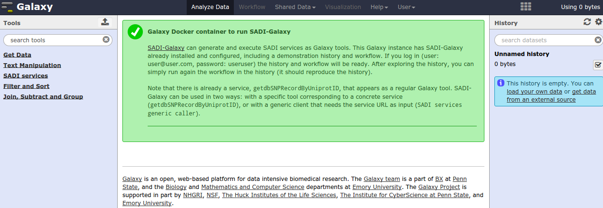
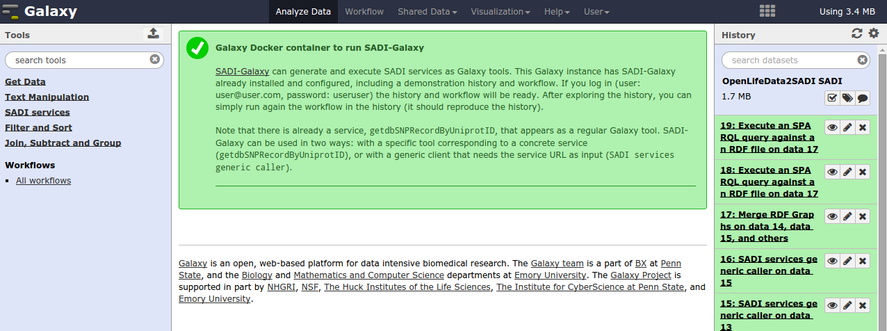
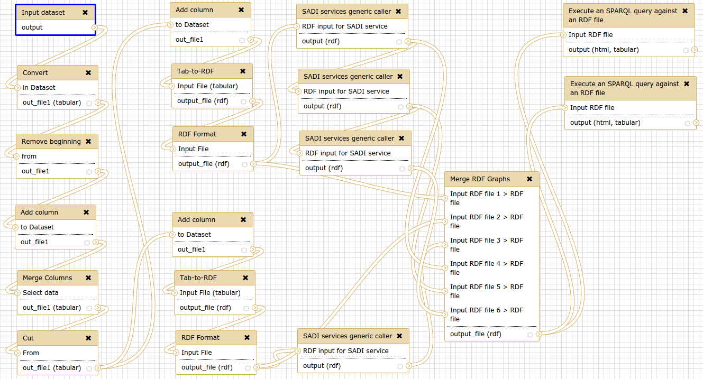
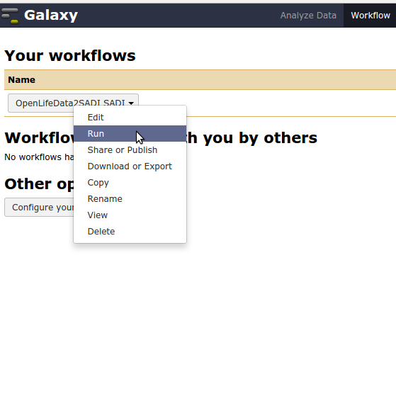
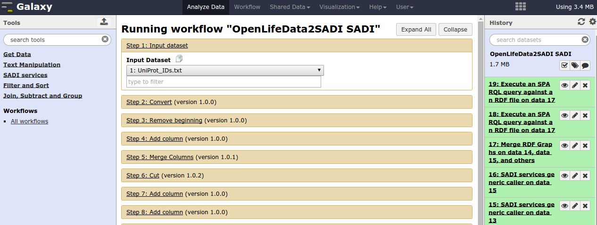
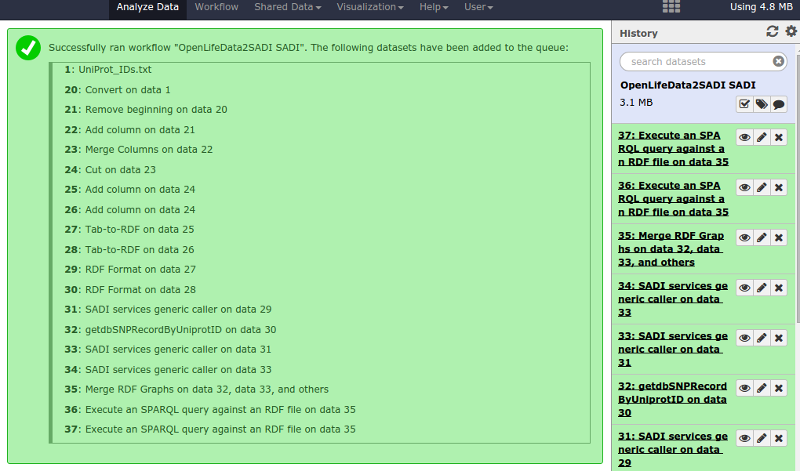

SADI-Galaxy-Docker
==================

About
-----

[SADI](http://sadiframework.org/content/about-sadi/) is a framework to define Semantic Web Services that consume and output [RDF](http://www.w3.org/standards/techs/rdf), and [SADI-Galaxy](https://github.com/mikel-egana-aranguren/SADI-Galaxy) makes SADI services available in the popular [Galaxy](http://galaxyproject.org/) platform. Thus, SADI-Galaxy is a nice SADI client to invoke SADI services in an environment that Biologists use often.

On the other hand, [Docker](http://www.docker.com/whatisdocker/) is a sort of "virtualisation" environment for deploying applications very easily, without configuration. Therefore I have created a Docker image for deploying a Galaxy instance already containing SADI-Galaxy, so anyone interested in SADI-Galaxy can try it out easily within having to configure Galaxy and SADI-Galaxy.   

Deploying the container
-----------------------

Install Docker and do the thingy for avoiding sudo access: 

```
$ sudo apt-get install docker.io
$ sudo groupadd docker
$ sudo gpasswd -a your_user docker
$ sudo service docker.io restart
```

(You might need to log out and back in).

Pull the [SADI-Galaxy Docker image](https://registry.hub.docker.com/u/mikeleganaaranguren/sadi-galaxy):

```
$ docker pull mikeleganaaranguren/sadi-galaxy
```

Check that it has been succesfully pulled:

```
$  docker images

REPOSITORY                        TAG                 IMAGE ID            CREATED             VIRTUAL SIZE
mikeleganaaranguren/sadi-galaxy   latest              xxxxxxxxxxx        3 days ago          895.8 MB
```

Run the container (Make sure that the port 8080 is listening and free in the host machine, or use a different one and map it to the container, e.g. 8389:8080):

```
$ docker run -d -p 8080:8080 mikeleganaaranguren/sadi-galaxy
```

If you go with your web browser to http://127.0.0.1:8080 (or the IP of the host machine) there should be a Galaxy server runing. The SADI tools are under `SADI services`, on the left pane.



Login (in the `User` menu on the top; user:`user@user.com`, password:`useruser`) and a history should appear on the right pane.



In the `Workflow` menu, there is only one workflow, `OpenLifeData2SADI SADI`. You can have a look by clicking on the workflow name and then clicking `edit`:



Run the workflow.



Use dataset 1 from the history as input for the workflow (`UniProt_IDs.txt`).



When the worfklow has finished new steps will appear in the history (20-37).



You can use the workflow, by inspecting the steps, to become familiar with SADI-Galaxy.


